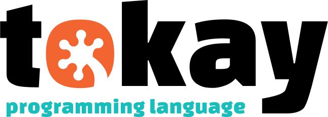
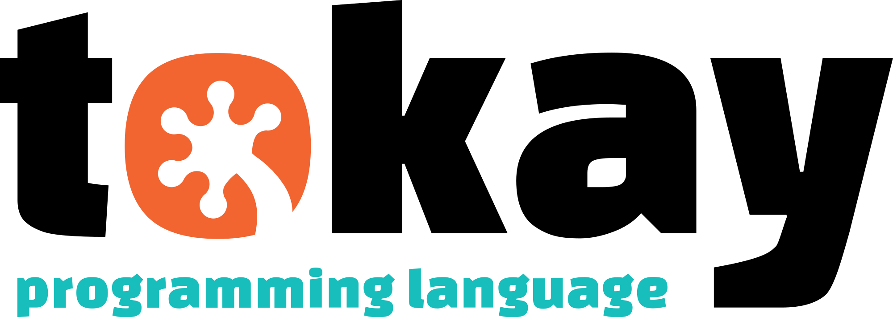
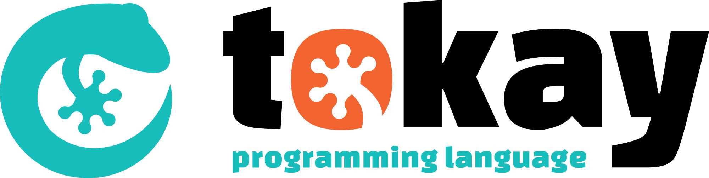
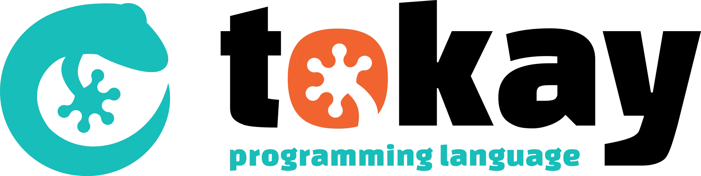
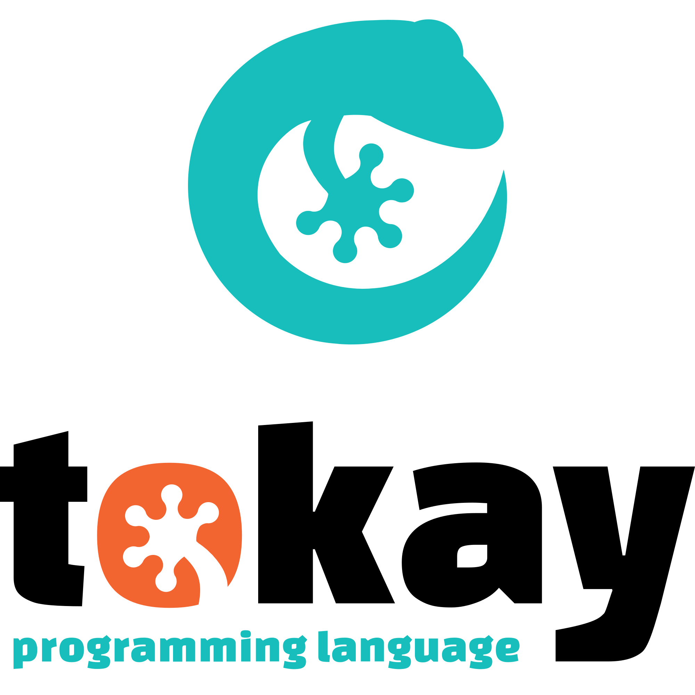
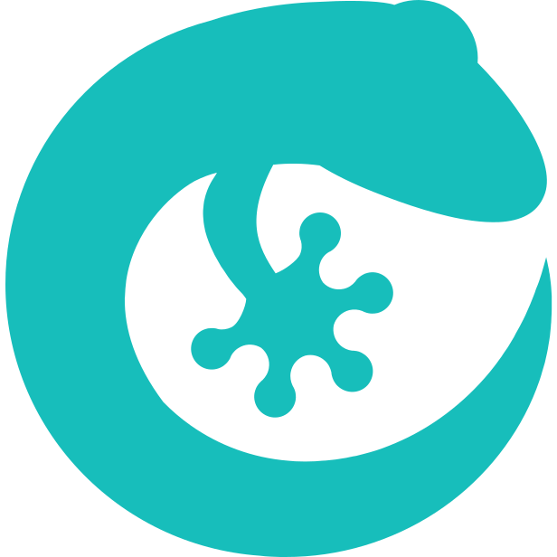

# Tokay Artwork

This repostitory contains artwork relating the [Tokay programming language](https://tokay.dev). It is licensed by Creative Commons CC-BY-SA 4.0.

The artwork was initially created and designed by [Timmytiefkuehl](https://github.com/timmytiefkuehl).

---

## banner-with-subline

### banner-with-subline.svg

### rendered/banner-with-subline.png

### rendered/banner-with-subline.webp

## banner

### banner.svg

### rendered/banner.png

### rendered/banner.webp

## full-landscape

### full-landscape.svg

### rendered/full-landscape.png

### rendered/full-landscape.webp

## full-portrait

### full-portrait.svg

### rendered/full-portrait.png

### rendered/full-portrait.webp

## lizard

### lizard.svg

### rendered/lizard.png

### rendered/lizard.webp

## paw

### paw.svg

### rendered/paw.png

### rendered/paw.webp

